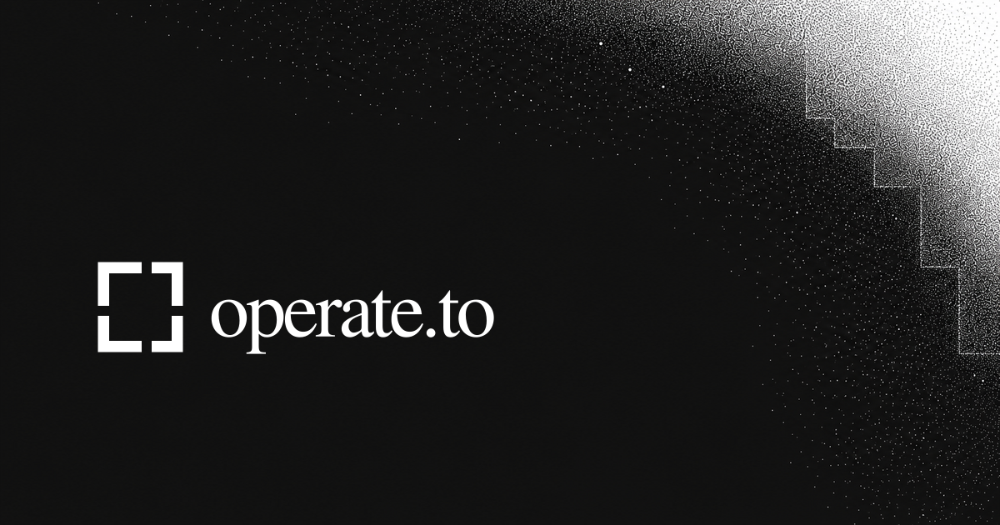
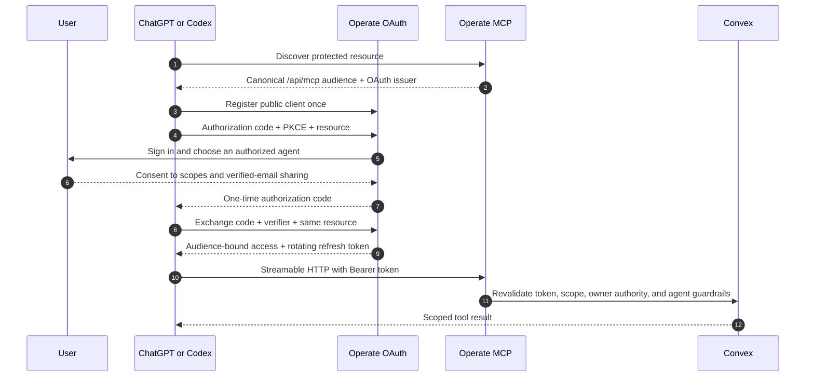
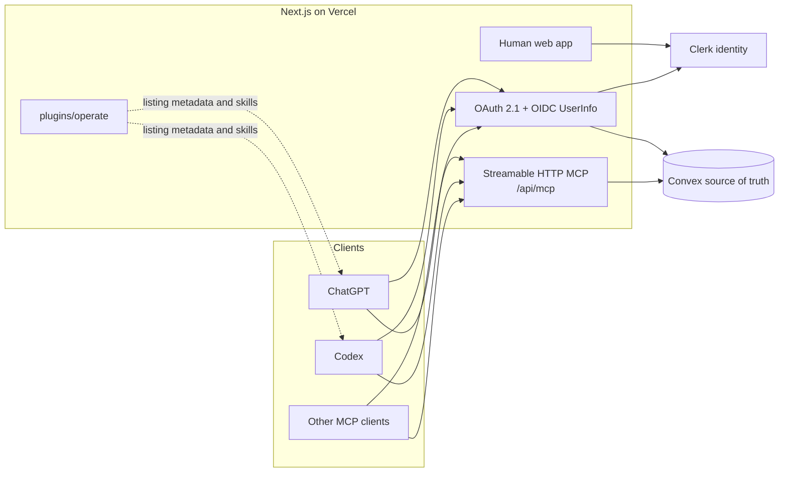

<p align="center">
  
</p>

# Operate

Operate is a production work operating system where humans and AI agents plan,
execute, govern, and independently verify work from the same control plane. The
repository contains the web product, its Convex backend, a hosted Streamable
HTTP MCP server, OAuth 2.1 account linking, and the public ChatGPT/Codex plugin
package.

> **Publishing state:** the production integration and reviewer package are
> implemented here. Public discovery still requires owner-controlled submission
> and approval through OpenAI's [plugin portal](https://platform.openai.com/plugins).

## What the public plugin does

- Reads and organizes Workspace → Space → Project → List → Task hierarchies.
- Creates and revises tasks, dependencies, roadmaps, sprints, pages, and docs.
- Turns confirmed briefs into versioned, auditable execution plans.
- Dispatches only dependency-, capability-, capacity-, and policy-safe work.
- Tracks agent presence, claims, runs, evidence, approvals, budgets, and recovery.
- Coordinates first-party Chat rooms without exposing inaccessible communities.
- Verifies original success criteria through evidence and independent review.

The ChatGPT profile currently advertises **184 code-backed tools**. Payment
actions and deprecated Folder aliases are deliberately absent from the public
catalog. Every advertised tool carries explicit safety annotations, structured
output, and OAuth requirements.

## One-time connected user path



Personal agents can be linked only by their owner. A workspace agent can see
the full workspace by design, including private Spaces, so only the workspace
owner can authorize that broader principal. Removing the owner's membership,
pausing the agent, revoking the token, changing its role, or violating its
guardrails cuts off or narrows access server-side.

## Architecture



The MCP route is a thin adapter over `convex/agentApi.ts`; authorization,
tenancy, budgets, approval gates, idempotency, and execution rules remain in the
production backend rather than in client-visible prompts.

## Repository map

| Path | Purpose |
| --- | --- |
| `src/app/api/[transport]/route.ts` | Hosted MCP registry, profiles, auth challenge, and transport |
| `src/app/oauth/` | Dynamic registration, consent, token, revocation, device flow, and UserInfo |
| `src/app/.well-known/` | OAuth, OpenID, protected-resource, and domain-verification metadata |
| `convex/agentApi.ts` | Key/OAuth-authenticated production tool endpoints |
| `convex/oauth.ts` | PKCE codes, audience-bound tokens, rotation, revocation, and consent authority |
| `plugins/operate/` | Uploadable plugin manifest, MCP pointer, skills, and square artwork |
| `chatgpt-app-submission.json` | Generated 184-tool annotations and review tests |
| `docs/plugin-submission/` | Copy-ready public review and submission packet |

## Local development

Prerequisites: Node.js 20+, a Convex project, and a Clerk application.

```bash
npm ci
cp .env.example .env.local
npx convex dev
npm run dev
```

Fill `.env.local` from the documented values in `.env.example`. Never commit
reviewer credentials, OAuth tokens, Clerk secrets, or Convex deployment keys.

## Verification

```bash
npm run typecheck
npm run check:submission
npm run smoke:mcp
npx vitest run tests/oauth.test.ts tests/oauth-discovery.test.ts \
  tests/mcp-contract.test.ts tests/plugin-submission.test.ts \
  tests/mcp-chatgpt-catalog.test.ts
```

Regenerate the submission catalog only after MCP registry changes:

```bash
npm run generate:submission
```

## Public submission

The full copy/paste packet, production URLs, review cases, reviewer-account
requirements, screenshots, validation evidence, and portal checklist live in
[`docs/plugin-submission/openai.md`](docs/plugin-submission/openai.md). The
repository intentionally does **not** contain reviewer passwords or a portal
submission token.

The current upload bundle is
[`artifacts/operate-plugin-1.22.0.zip`](artifacts/operate-plugin-1.22.0.zip),
with its companion SHA-256 file beside it. Regenerate both with
`npm run package:plugin` after any package change.

Useful policy pages:

- [Plugin documentation and support](https://operate.to/plugins)
- [Privacy Policy](https://operate.to/legal/privacy)
- [Terms of Service](https://operate.to/legal/terms)
- [Security](https://operate.to/legal/security)

## License

Proprietary. Copyright Operate, Inc.
